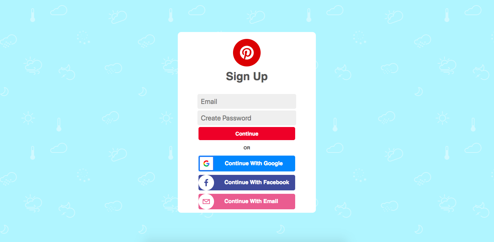
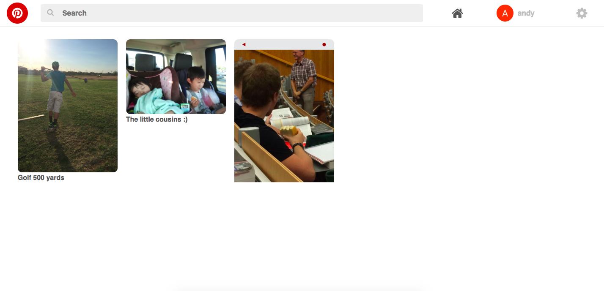

# Pinterest Clone
This project was built because I wanted to learn how store data-types such as gifs, jpg, png using FIREBASE. I also wanted to increase my knowlege of using redux with this React appliaction. The Firebase api made things really easy to store pictures and gifs but the downfall of using is that it is relatively slow when rendering.

### Website can be found [here](https://pinterest-4e52b.firebaseapp.com/login)

# Final Product
## Login

## Page

## Built With

* [React](https://reactjs.org/) - Web Framework
* [Redux](https://redux.js.org/) - Data Store for react
* [Firebase](https://firebase.google.com) - Database

## Authors

* **[Andrew Ty Nguyen](https://github.com/Andyt-Nguyen)**

